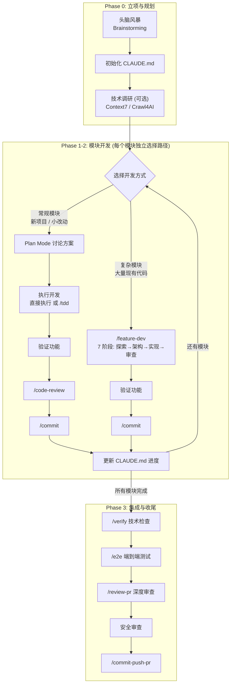
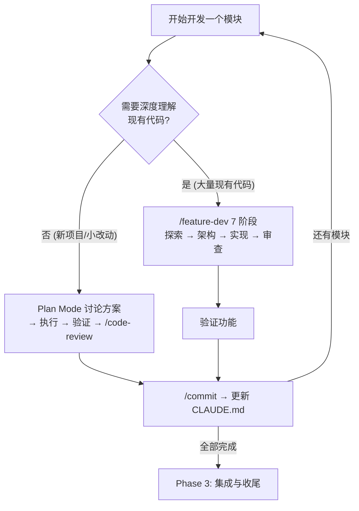
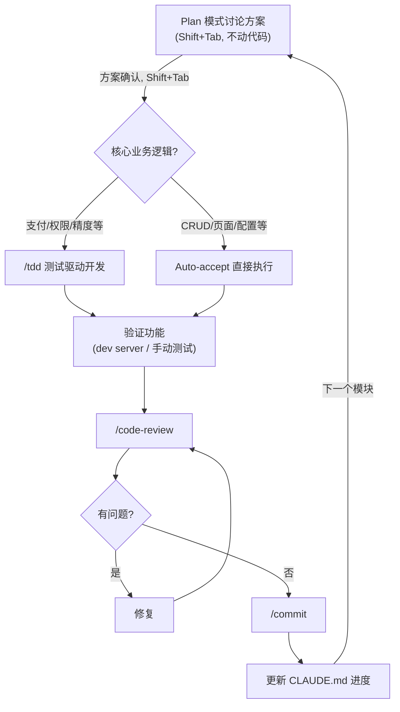
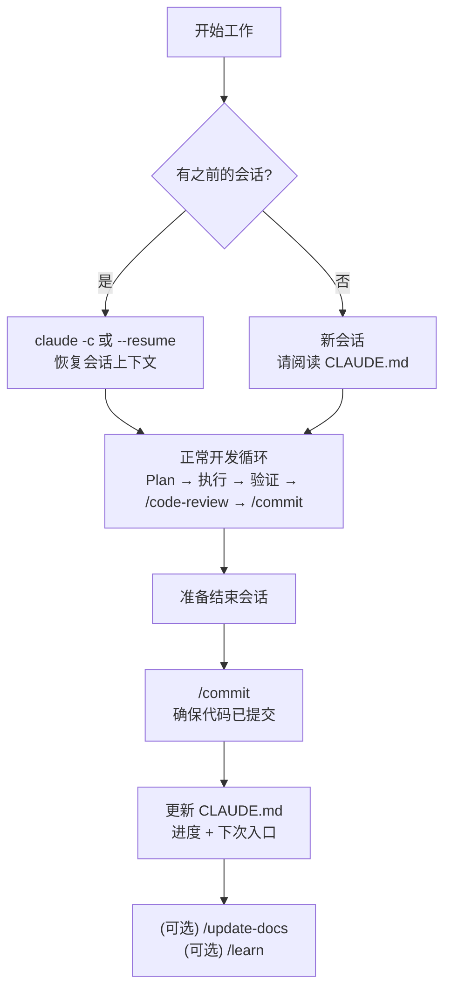

# Claude Code 项目工作流手册 (Project Workflow Guide)

> **定位**: 本手册是 `README.md`（技能参考手册）的配套实操指南。
> README 回答"有什么工具"，本手册回答"怎么用这些工具跑完一个项目"。

---

## 目录

1. [项目生命周期总览](#1-项目生命周期总览)
2. [Plan Mode 与 /plan 命令](#2-plan-mode-与-plan-命令)
3. [Phase 0：立项与规划](#3-phase-0立项与规划)
4. [路径选择与架构设计](#4-路径选择与架构设计)
5. [模块开发详解（Plan Mode 工作流）](#5-模块开发详解plan-mode-工作流)
6. [Phase 3：集成与收尾](#6-phase-3集成与收尾)
7. [会话管理：开始与结束仪式](#7-会话管理开始与结束仪式)
8. [跨会话持续性策略](#8-跨会话持续性策略)
9. [质量关卡速查](#9-质量关卡速查)
10. [故障排除与常见陷阱](#10-故障排除与常见陷阱)
11. [附录：CLAUDE.md 模板](#11-附录claudemd-模板)

---

## 1. 项目生命周期总览



| 阶段 | 目标 | 核心指令 | 产出物 |
|:---|:---|:---|:---|
| Phase 0 | 明确做什么、不做什么 | Brainstorming | 需求清单、CLAUDE.md 初版 |
| Phase 1-2 | 逐模块设计与实现 | **路径 A**: Plan Mode → 执行 → 验证 → `/code-review` → `/commit` | 可运行的代码 + 测试 |
|  |  | **路径 B**: `/feature-dev`（7 阶段一体化）→ 验证 → `/commit` |  |
| Phase 3 | 全局验证与上线 | `/verify` → `/e2e` → `/review-pr` → 安全审查 → `/commit-push-pr` | PR、部署产物 |

---

## 2. Plan Mode 与 /plan 命令

在深入工作流之前，必须理解两个容易混淆的规划工具。它们是不同层面的东西，可以搭配使用。

### Plan Mode（内置模式切换）

Claude Code 内置的**权限模式**，通过 `Shift+Tab` 在输入框中循环切换：

```
Shift+Tab 循环：Normal → Plan → Auto-accept → Normal → ...
```

| 模式 | Claude 的行为 |
|:---|:---|
| **Normal** | 默认模式，每次编辑都请求你批准 |
| **Plan** | **只思考和讨论，不修改任何文件**。你可以反复对话直到方案满意 |
| **Auto-accept** | 自动执行所有编辑，不再逐个请求批准 |

也可以通过 CLI 启动时指定：`claude --permission-mode plan`

> **Claude Code 创始人 Boris Cherny 的做法**：几乎所有非平凡任务都先进入 Plan 模式，反复讨论直到满意，再切到 Auto-accept 让 Claude 一次完成。
> *"A good plan is really important!"*

### /plan 命令（ECC 插件）

`/plan` 是 everything-claude-code 插件提供的斜杠命令，调用 **Planner Agent** 输出一份结构化的实施步骤文档。

### 区别与选择

| 维度 | Plan Mode (`Shift+Tab`) | `/plan` 命令 |
|:---|:---|:---|
| 来源 | Claude Code 内置 | everything-claude-code 插件 |
| 本质 | **模式开关**，控制 Claude 是否能编辑文件 | **Agent 调用**，输出实施计划文档 |
| 交互 | 多轮自由对话，可质疑、对比、要求探查代码 | 单轮输出结构化方案 |
| 工具 | 主 agent 全部工具可用 | planner agent 仅有 Read/Grep/Glob |
| 深度 | 取决于讨论轮数，上不封顶 | 一次推理，按模板填充 |

### 如何选择

**一句话：能一句话说清的用 `/plan`，说不清的用 Plan Mode。**

| 场景 | 选择 | 原因 |
|:---|:---|:---|
| 需求明确，实现路径清晰（如"加一个 CRUD"） | `/plan` | 不需要讨论，快速出步骤直接执行 |
| 需求明确但有技术选型要权衡 | Plan Mode | 需要对比方案、讨论 trade-off |
| 需求模糊，做之前要先探查代码 | Plan Mode | 需要 Claude 用全部工具探索代码库 |
| 改动涉及多个模块，影响面大 | Plan Mode | 需要多轮讨论确认边界和风险 |
| 项目初期，不熟悉代码结构 | Plan Mode | 需要 Claude 先帮你理解现有架构 |

**推荐流程**：

```
1. Shift+Tab → 进入 Plan 模式
2. 多轮对话讨论方案，反复打磨直到满意
3. 让 Claude 把讨论结论整理成结构化文档并写入 CLAUDE.md
4. (可选) 用其他模型审查方案 ← 复杂功能建议做
5. /compact                    ← 方案已持久化，压缩上下文为执行腾出空间
6. Shift+Tab → 切到 Auto-accept 模式
7. Claude 按方案执行
```

> **可选：用独立模型审查方案**
> 复杂功能建议在执行前，将 CLAUDE.md 中的方案交给另一个 AI（Gemini、Codex 等）以 Staff Engineer 角色审查。
> 同一个模型讨论出的方案容易有确认偏误，独立模型能从不同角度发现盲点。
> 简单功能无需此步骤。

> **为什么不用 `/plan` 整理讨论结论？**
> `/plan` 会启动独立的 planner 子 agent 重新生成方案，而不是整理你们的讨论结论，内容可能与讨论结果有出入。
> 直接让主 agent 整理更准确：
>
> ```
> 把我们刚才讨论确定的方案整理成结构化文档，包含：
> 需求确认、架构变更、实施步骤、测试策略、风险评估
> 然后写入 CLAUDE.md
> ```

---

## 3. Phase 0：立项与规划

**目标**: 从模糊的想法收敛到可执行的需求清单。

### 步骤 1：头脑风暴

```
帮我头脑风暴一下 XXX 项目的方案
```

Brainstorming 技能会引导你思考：
- 核心用户是谁？解决什么问题？
- MVP 包含哪些功能？哪些是 v2？
- 有没有类似项目可以参考？

**产出**: 一份需求要点列表。

### 步骤 2：初始化 CLAUDE.md

头脑风暴结束后，立即让 Claude 创建项目的 `CLAUDE.md`：

```
根据刚才的头脑风暴结果，帮我在项目根目录创建 CLAUDE.md，
包含：项目简介、功能范围、模块拆分初稿、进度跟踪表
```

> **为什么这一步不能跳过？**
> `CLAUDE.md` 是 Claude Code 的"长期记忆"。每次新会话自动加载。
> 没有它，下次开会话你得从头解释一遍背景。

### 步骤 3：技术调研（可选）

如果技术选型不确定，可以利用工具辅助决策：

- **Context7 (MCP)**: 查阅框架最新文档，对比方案
- **Crawl4AI / Agent Browser**: 抓取竞品或参考项目的实现
- **Audit Website**: 如果是改造已有站点，先做全面体检

```
用 Context7 查一下 Next.js 15 和 Nuxt 4 在 SSR 性能上的差异
```

---

## 4. 路径选择与架构设计

**目标**: 确定技术方案、模块边界、数据模型。



### 两条路径

| 场景 | 推荐路径 | 说明 |
|:---|:---|:---|
| 新项目、或小型功能（3-5 个文件） | **Plan Mode 工作流** | 多轮讨论方案 → 执行 → 验证 → 审查 → 提交 |
| 已有代码库上的大功能（5+ 个文件） | **`/feature-dev` 工作流** | 7 阶段一体化：代码探索 → 架构 → 实现 → 审查 |

**选择关键**：`/feature-dev` 的独有价值在**代码探索**——它会派 2-3 个 agent 并行深入分析现有代码，发现可复用的模式和架构层次。如果项目已有大量代码需要理解，用 `/feature-dev`；如果是新项目或代码量不大，Plan Mode 讨论更灵活高效。

### 路径 A：Plan Mode 工作流

用 Plan Mode 讨论方案（参见第 2 节），确认后写入 CLAUDE.md，然后按第 5 节的流程执行开发。

### 路径 B：`/feature-dev` 工作流

```
/feature-dev "实现 Stripe 支付集成，支持一次性支付和订阅，包含 Webhook 处理"
```

**`/feature-dev` 的 7 个阶段**：

| 阶段 | 做什么 | 你需要做什么 |
|:---|:---|:---|
| Phase 1 Discovery | 确认需求 | 回答追问 |
| Phase 2 Exploration | 2-3 个 agent 并行扫描代码库 | 等待（这是独有价值） |
| Phase 3 Clarifying | 列出所有歧义 | 逐一确认 |
| Phase 4 Architecture | 2-3 个 architect agent 出方案 | **选择一种方案** |
| Phase 5 Implementation | 按方案实现 | 等待或介入 |
| Phase 6 Quality Review | 3 个 reviewer agent 并行审查 | 决定修复哪些问题 |
| Phase 7 Summary | 总结产出物 | 确认 |

**`/feature-dev` 完成后**：

`/feature-dev` 已包含实现和审查，但不包含验证、提交和进度持久化。完成后手动补充，然后直接进入下一个模块或 Phase 3：

```
1. 验证：运行 dev server / 测试套件，确认功能正常工作
2. /commit
3. 更新 CLAUDE.md 的进度
4. → 下一个模块（回到路径选择）或 → Phase 3 集成收尾
```

### 生成架构图（推荐）

无论走哪条路径，确认架构后建议生成可视化图：

```
用 mermaid-diagrams 画出系统架构图和模块依赖关系图
```

将生成的 Mermaid 代码保存在项目中（如 `docs/architecture.md`），方便后续查阅。

### 模块开始前检查清单

- [ ] `CLAUDE.md` 已包含完整的架构信息
- [ ] 模块拆分明确，每个模块有清晰的职责边界
- [ ] 技术选型已确定并记录理由
- [ ] 数据模型已设计（至少是草案）
- [ ] `/commit` 提交当前状态

---

## 5. 模块开发详解（Plan Mode 工作流）

**目标**: 按模块逐个实现，每个模块走完整的开发-测试-审查流程。本节详解路径 A（Plan Mode）的具体操作。路径 B（`/feature-dev`）的操作详见第 4 节。

### 5.1 核心原则

1. **每次只做一个功能** — 不要试图在一次会话中完成所有模块。一次做太多会导致上下文耗尽，留下半成品（Anthropic 官方称此为 "one-shotting" 失败模式）。
2. **先基础后业务**: 数据库 → 认证 → 核心业务 → 辅助功能
3. **先后端后前端**: API → 页面 → 交互优化
4. **先主路径后边界**: Happy path → 错误处理 → 边界场景

### 5.2 单模块开发流程

每个模块按以下顺序执行：



#### 第一步：Plan 模式讨论方案

`Shift+Tab` 进入 Plan 模式（参见第 2 节），用自然语言和 Claude 讨论模块的实现方案：

```
Shift+Tab → 进入 Plan 模式

实现订单模块的 CRUD API，包括创建订单、查询列表（分页）、查看详情、取消订单。
数据库用什么表结构？API 路由怎么设计？分页用 cursor-based 还是 offset？
```

Plan 模式的核心是**多轮对话**——你可以质疑方案、提出约束、要求 Claude 探查现有代码、对比不同方案，直到满意为止。这是规划环节最重要的部分。

`/plan` 可以作为**可选的起点**——如果你不确定从哪里开始讨论，先用 `/plan "模块描述"` 让 Claude 输出一份结构化方案，然后在 Plan 模式下针对这份方案逐项讨论修改。

> **注意**: Plan 模式下的讨论和 `/plan` 的输出都只存在于当前会话中，不会自动保存到项目文件。
> 方案确认后，让 Claude 把关键决策写入 CLAUDE.md：
>
> ```
> 把刚才确认的实施方案要点更新到 CLAUDE.md 的"当前进度"部分
> ```

#### 第二步：执行开发

方案确认后，`Shift+Tab` 切到 Auto-accept 模式，让 Claude 按讨论好的方案实现并编写测试。

大多数功能直接执行即可。以下场景建议用 `/tdd` 替代：

| 场景 | 选择 | 原因 |
|:---|:---|:---|
| CRUD、页面、配置等常规功能 | 直接执行 | 逻辑清晰，计划中已包含测试策略 |
| 支付计算、权限判断、数据转换等核心逻辑 | `/tdd` | 边界多、出错代价高，先写测试能定义清楚接口契约 |
| 涉及精度、并发、状态机等容易出错的逻辑 | `/tdd` | 先定义期望行为，再写实现去满足 |

```
/tdd "订单金额计算：商品单价×数量，满减优惠，运费阶梯计算，精度到分"
```

#### 第三步：验证

> *"给 Claude 一种验证自己工作的方式，质量会提升 2-3 倍。"* — Boris Cherny

**每个功能都应验证，不要等到最后。** 验证方式取决于项目类型：

- **API 项目**: 运行测试套件，用 curl 或 Postman 手动测一遍
- **Web 项目**: 启动 dev server，用 Agent Browser 或手动浏览器验证 UI
- **CLI 工具**: 运行实际命令，检查输出

```
运行 dev server 并验证刚才实现的订单创建功能是否正常工作
```

> **关于 `/verify`**: 构建、类型、lint 等技术检查已由 PostToolUse hooks 在每次编辑后实时执行，模块级无需额外跑 `/verify`。`/verify` 作为全量技术兜底放在 Phase 3 集成收尾阶段（见 6.1 节）。

#### 第四步：代码审查

```
/code-review
```

修复审查发现的问题后继续。

> **何时可以跳过？** 对于简单模块（CRUD、配置、样式），PostToolUse hooks 已覆盖格式化、类型检查和 console.log 检测。可以跳过模块级 `/code-review`，留到 Phase 3 的 `/review-pr` 做批量深度审查。核心业务模块（支付、权限、数据处理）建议保留。

#### 第五步：提交并更新进度

```
/commit
```

然后更新 `CLAUDE.md`：

```
帮我更新 CLAUDE.md 的进度，标记订单模块的 CRUD API 已完成
```

### 5.3 模块间的衔接

模块完成后，**先评估上下文状态再决定如何继续**：

| 上下文使用量 | 下一步 | 操作 |
|:---|:---|:---|
| < 50% | 继续当前会话 | 直接开始下一个模块 |
| 50-70% | `/compact` 后继续 | 压缩上下文，保留关键信息再继续 |
| > 70%，或下个模块复杂 | 开新会话 | `/commit` → 更新 CLAUDE.md → 开新会话 |
| 刚跑完 `/feature-dev` | 开新会话 | 7-9 个 subagent 报告已填满上下文 |

> **如何查看上下文用量？** 观察 Claude Code 状态栏的 token 计数。

**继续当前会话时**：

```
我已完成订单模块，现在开始开发支付模块。
请先阅读 CLAUDE.md 了解整体架构，然后我们讨论支付模块的实现方案。
```

**开新会话时**：

```bash
# 确保当前会话已 /commit 并更新了 CLAUDE.md
claude                        # 开新会话
请阅读 CLAUDE.md，从支付模块开始
```

### 5.4 复杂模块：使用 `/feature-dev`

如果某个模块涉及大量现有代码需要理解（如在已有系统上集成支付），可以用 `/feature-dev` 替代 Plan Mode 工作流来处理该模块。`/feature-dev` 的代码探索阶段（Exploration）能派 2-3 个 agent 并行分析现有代码中可复用的模式，这是 Plan Mode 做不到的。`/feature-dev` 完成后直接进入下一个模块，无需再走 5.2 的流程。

```
/feature-dev "实现 Stripe 支付集成，支持一次性支付和订阅，包含 Webhook 处理"
```

完成后补充验证、提交和更新进度（详见第 4 节"路径 B"）。

### 5.5 上下文管理

> 上下文窗口是 Claude Code 最核心的约束。社区反馈中，上下文管理不当是**排名第一的失败原因**。

#### 核心工具

| 命令 | 作用 | 何时使用 |
|:---|:---|:---|
| `/compact` | 压缩对话历史，保留关键信息 | 上下文 50-70% 时主动使用 |
| `/clear` | 完全清除对话历史（不可逆） | 切换到完全无关的任务时 |
| `!command` | 直接执行 bash 命令，不经模型处理，零 token 消耗 | 运行你已知的命令（`!git status`、`!npm test`） |

#### 上下文退化的信号

当出现以下症状时，说明上下文已开始退化：

- Claude 开始犯之前没犯过的低级错误
- Claude 忘记了会话早期讨论过的约定
- Claude 尝试随机方案而不是推理解决问题
- 你发现自己在重复之前说过的话

**一旦出现这些信号，不要继续推**。执行 `/compact`，或者 `/commit` 后开新会话。

#### 推荐策略：Plan 讨论后压缩

Plan Mode 讨论可能消耗 20-30% 上下文。讨论完毕后：

```
1. 让 Claude 把方案写入 CLAUDE.md
2. /compact               ← 方案已持久化，可以安全压缩
3. Shift+Tab → Auto-accept 模式开始执行
```

这样执行阶段能获得最大的可用上下文。

#### Subagent 原则

把探索性工作交给 subagent，保持主上下文干净：

```
用 subagent 调查 src/payments/ 的支付流程实现，总结关键发现
```

Subagent 在独立上下文中工作，只向主 agent 返回摘要。这避免了大量文件内容填满主上下文。

---

## 6. Phase 3：集成与收尾

**目标**: 所有模块完成后的全局验证、优化和上线准备。

### 6.1 技术验证

```
/verify
```

对整个项目做一次全量技术检查：构建（Build）→ 类型（Types）→ 代码规范（Lint）→ 测试套件（Tests）→ Console.log 审计 → Git 状态。模块开发阶段 PostToolUse hooks 已做实时检查，这里是上线前的最终兜底。

### 6.2 端到端测试

```
/e2e
```

覆盖关键用户流程：注册 → 登录 → 核心操作 → 支付 → 退出。

### 6.3 深度 PR 审查

```
/review-pr
```

这比 `/code-review` 更重，6 个维度的专家审查，适合合并到主分支前。

### 6.4 安全审查

Security Reviewer 会在涉及认证、用户输入时自动触发。
但在上线前建议手动做一次全面检查：

```
对整个项目做一次安全审查，重点检查认证流程、API 权限、输入校验
```

### 6.5 性能与审计（针对 Web 项目）

```
用 audit-website 对站点做全面体检
```

### 6.6 提交并创建 PR

```
/commit-push-pr
```

---

## 7. 会话管理：开始与结束仪式

Claude Code 的每次会话是独立的。通过固定的"仪式"保证跨会话的连续性。



### 恢复已有会话

在开新会话之前，先考虑是否可以恢复之前的会话：

```bash
claude -c                    # 继续最近一次会话（保留完整上下文）
claude --resume              # 弹出选择器，列出最近的会话供你选择
claude --resume abc123       # 恢复指定 ID 的会话
```

恢复的会话保留之前的全部对话上下文，不需要重新解释背景。

### 会话开始仪式（新会话）

如果是全新会话：

```
请阅读 CLAUDE.md，告诉我当前项目进度和下一步应该做什么
```

Claude 会自动加载 `CLAUDE.md`，但显式要求它总结一遍可以确保理解一致。

### 会话结束仪式

每次关闭会话前执行：

```
必做: /commit                        ← 确保代码已提交
必做: 更新 CLAUDE.md 的进度和下次入口   ← 为下次会话留交接信息
可选: /update-docs                   ← 有较多文件变更时更新代码地图
可选: /learn                         ← 踩到坑或发现重要经验时提取教训
```

更新 CLAUDE.md 的示例：

```
帮我更新 CLAUDE.md：
- 标记模块 B 已完成
- 在"下次继续的入口"写上：从模块 C（支付集成）开始，先设计 Webhook 处理流程
- 记录本次发现的注意事项（如果有）
```

### 会话仪式速查卡

```
┌──────────────────────────────────────────────────┐
│             恢复会话（优先）                       │
│  claude -c  或  claude --resume                   │
├──────────────────────────────────────────────────┤
│             新会话开始                            │
│  "请阅读 CLAUDE.md，总结进度和下一步"              │
├──────────────────────────────────────────────────┤
│             正常开发                              │
│  Plan模式讨论 → 执行 → 验证 → /code-review        │
│  → /commit                                       │
├──────────────────────────────────────────────────┤
│             会话结束                              │
│  /commit → 更新CLAUDE.md → (可选)/update-docs/learn│
└──────────────────────────────────────────────────┘
```

---

## 8. 跨会话持续性策略

### 8.1 持久化层级

项目的"记忆"分三层，从自动到手动：

| 层级 | 载体 | 加载方式 | 内容 |
|:---|:---|:---|:---|
| **L1 自动** | `CLAUDE.md` | 每次会话自动加载 | 项目概况、架构、进度、下次入口 |
| **L2 半自动** | `/learn` 产出 | 持久化到 `~/.claude/` | 经验教训、踩坑记录 |
| **L3 手动** | `docs/` 目录下的文档 | 需要时手动让 Claude 读取 | 架构图、API 文档、设计决策记录 |

### 8.2 CLAUDE.md 的维护原则

1. **保持精简**: 控制在 500 行以内，过长会稀释关键信息（附录模板约 60 行，留足业务内容空间）
2. **结构稳定**: 使用固定的 section 结构，每次只更新变化的部分
3. **指令明确**: "下次继续的入口"要写得像交接文档——下一个人（或下一次的你）能直接上手
4. **定期清理**: 已完成的模块细节可以精简为一行记录，不需要保留完整的步骤

### 8.3 大型项目的分级策略

当项目超过 5 个模块时，考虑分级管理：

```
项目根目录/
├── CLAUDE.md              ← 全局：架构、模块清单、总进度
├── src/
│   ├── auth/
│   │   └── CLAUDE.md      ← 模块级：认证模块的细节上下文
│   ├── orders/
│   │   └── CLAUDE.md      ← 模块级：订单模块的细节上下文
│   └── payments/
│       └── CLAUDE.md      ← 模块级：支付模块的细节上下文
└── docs/
    └── architecture.md    ← 架构图（Mermaid）
```

根目录的 `CLAUDE.md` 保持全局视角，模块级的 `CLAUDE.md` 放该模块的详细上下文。

开发某个模块时：

```
请阅读根目录 CLAUDE.md 了解全局，然后阅读 src/payments/CLAUDE.md 了解支付模块详情
```

---

## 9. 质量关卡速查

在不同阶段应触发的质量检查：

| 时机 | 触发动作 | 说明 |
|:---|:---|:---|
| 写完一段代码 | `/code-review` | 日常轻量检查（简单模块可跳过，见 5.2） |
| 构建失败 | `/fix` | 自动诊断修复 |
| 核心逻辑开发时 | `/tdd` 测试驱动开发 | 支付/权限/精度等场景，确保覆盖率 80%+ |
| 涉及数据库改动 | Database Reviewer 自动触发 | Schema、索引、RLS 检查 |
| 涉及认证/用户输入 | Security Reviewer 自动触发 | OWASP Top 10 检查 |
| 所有模块完成、上线前 | `/verify` | 全量技术兜底：构建 + 类型 + lint + 测试 + console.log |
| 合并到主分支前 | `/review-pr` | 6 维度深度审查 |
| 上线前 | `/e2e` + `audit-website` | 端到端测试 + 全面审计 |

---

## 10. 故障排除与常见陷阱

### 构建失败

```
/fix
```

如果 `/fix` 无法解决，尝试更具针对性的命令：
- TypeScript 错误: `/build-fix`
- Go 编译错误: `/go-build`

### 测试失败

```
/tdd
```

原则：**修实现，不改测试**（除非测试本身有误）。

### 方向跑偏：Re-plan

> *"Plan Mode discipline: when something goes sideways, re-plan. Don't keep pushing."* — Boris Cherny

当发现实现偏离预期、越改越乱时，**停下来重新规划**，不要硬推：

```
Shift+Tab → 切回 Plan 模式
当前实现遇到了 XXX 问题，让我们重新规划一下方案
```

这比反复用 `/fix` 修补更有效。

### 会话上下文丢失

如果感觉 Claude 偏离了之前的约定：

```
请重新阅读 CLAUDE.md，严格按照其中的架构决策和技术选型继续开发
```

### 代码质量下降

```
/refactor-clean
```

分析死代码、冗余代码并安全清除。

### 常见陷阱（来自 Anthropic 官方总结）

| 陷阱 | 症状 | 对策 |
|:---|:---|:---|
| **One-shotting** | 试图一次做完所有模块，上下文耗尽，留下半成品 | 每次只做一个功能，做完提交再做下一个 |
| **Premature Completion** | Claude 看到已有部分功能就宣布完成，实际还有很多没做 | 在 CLAUDE.md 中维护明确的功能清单和状态标记 |
| **Context Exhaustion** | 项目后期 Claude 要读太多文件，上下文不够用 | 及时 `/compact`；保持 CLAUDE.md 精简；用模块级 CLAUDE.md 分散上下文（详见 5.5） |
| **MCP 上下文挤占** | 启用过多 MCP 后，200k 上下文缩减到 70k | 在项目配置中用 `disabledMcpServers` 禁用不需要的 MCP |

---

## 11. 附录：CLAUDE.md 模板

新项目初始化时推荐的 `CLAUDE.md` 结构：

```markdown
# [项目名称]

## 项目简介
一句话描述项目目标。

## 功能范围
### 包含 (In Scope)
- 功能 A
- 功能 B

### 不包含 (Out of Scope)
- 功能 X（计划 v2）
- 功能 Y（不做）

## 技术选型
| 类别 | 选择 | 理由 |
|:---|:---|:---|
| 框架 | | |
| 数据库 | | |
| 认证 | | |
| 部署 | | |

## 架构概览
（简要描述，可引用 docs/architecture.md 中的 Mermaid 图）

## 模块拆分与进度
| 模块 | 状态 | 会话 | 备注 |
|:---|:---|:---|:---|
| 数据库 Schema | 已完成 | Session 1 | |
| 用户认证 | 已完成 | Session 2 | |
| 订单系统 | 进行中 | Session 3 | CRUD 已完成，缺分页 |
| 支付集成 | 未开始 | - | |
| 管理后台 | 未开始 | - | |

## 当前进度
### 已完成
- 数据库 Schema 设计与迁移
- 用户注册/登录 API

### 进行中
- 订单系统：CRUD API 已完成，正在实现分页查询

## 下次继续的入口
从订单模块的分页查询开始。参考 src/orders/CLAUDE.md 中的 API 契约。
注意：分页使用 cursor-based 而非 offset-based（见 ADR-3）。

## 架构决策记录 (ADR)
### ADR-1: 选择 Next.js 而非 Nuxt
原因：团队更熟悉 React 生态...

### ADR-2: 使用 Supabase 而非自建 PostgreSQL
原因：MVP 阶段优先开发速度...

### ADR-3: 分页使用 cursor-based
原因：数据量大时 offset 性能差...

## 注意事项
- Stripe Webhook 需要配置公网 URL（开发时用 ngrok）
- 环境变量清单见 .env.example
```
